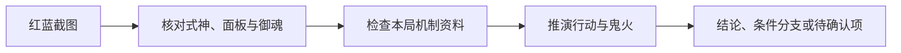

# 阴阳师对弈竞猜预测 Skill

把红蓝双方的阵容详情截图交给 AI，它可能很快给出胜负倾向。但只要认错一个御魂、漏掉一段技能升级效果，或把自动战斗当成人工操作，后面的推演就会建立在错误输入上。

这是一个面向《阴阳师》对弈竞猜的**非官方开源 Skill**：先把本轮截图和机制资料核对清楚，再沿着行动、鬼火、技能、御魂和自动选目标的规则推演。结论能回看依据；关键资料不足时，会说明缺口和可能翻转结果的分支。



它着重处理三个容易让 AI 推演走偏的地方：

- **输入核验：**逐格检查十名式神、八项面板和十个御魂图案；低置信度识别留给人核对。截图定位依据表格内容，已用手机、平板和模拟器截图验证，不要求整图固定比例。
- **机制补全：**只针对本局出现的式神和御魂，检查技能升级、御魂效果、自动选技能与目标规则，列出缺失或冲突的证据。
- **可复查的推演：**记录关键行动、来源和鬼火账；随机目标或未知结算顺序保留分支。需要时可让多个模型独立分析同一份输入包，再汇总票据。

> 首次使用时，可以让你的 AI 智能体协助整理和导入资料；来源、使用权限及当前版本需要你确认。准备好后，后续每轮可以复用。

## 先看它怎样检查推演

仓库自带一个**完全虚构**的例子，不需要游戏资料或 OCR 依赖：

```powershell
python examples/synthetic_demo.py
```

它会构造推演包和票据，验证一笔正确的鬼火账，并拦下故意写错的结算。例如票据声称“行动前 4 火、技能耗 0 火、没有回火，行动后却有 5 火”，校验器会拒绝这张票。因没有真实对局资料，演示最后会弃权。输出中的关键结果是：

```json
{"ballot_valid": true, "invalid_fire_ballot_blocked": true, "prediction": "abstain"}
```

这个例子展示的是**如何检查推演过程**，不是一次真实对局预测；真实对局还需要本轮截图和机制资料。

## 安装与首次使用

将整个仓库放进支持 `SKILL.md` 的智能体 skills 目录。Codex 用户可在 PowerShell 中运行：

```powershell
git clone https://github.com/shuangyiskr/yys-duiyi-predict.git "$env:USERPROFILE\.agents\skills\yys-duiyi-predict"
cd "$env:USERPROFILE\.agents\skills\yys-duiyi-predict"
```

需要保留 `SKILL.md`、`scripts/` 和 `references/`；只复制 `SKILL.md` 无法运行脚本。若安装后 Codex 未显示该 Skill，重启 Codex。其他智能体请按各自的技能目录约定安装。已在 Windows + Python 3.11 验证。

```powershell
python -m venv .venv
.\.venv\Scripts\python -m pip install -r requirements.txt
.\.venv\Scripts\python scripts/bootstrap_data.py
```

最后一条建立本地资料槽并报告覆盖度；零条目表示资料尚未准备。仓库不随附游戏技能文案、御魂图片和自动战斗资料。

安装后，把红蓝双方阵容详情截图交给智能体，例如：

> 使用 `$yys-duiyi-predict` 分析本轮对弈竞猜。红方截图在 `C:\path\to\red.png`，蓝方截图在 `C:\path\to\blue.png`。请先核对截图和本局资料，补齐可用资料，再推演；不能核实的地方请列出来。

也可以直接描述任务，让支持该 Skill 的智能体自行选择。第一次准备资料和核对御魂通常需要更多时间，后续轮次可复用已确认的本地资料。

## 导入本地资料

资料可整理为以下目录，然后本地导入：

```text
my-data/
  references/
    official_skills_snapshot.json
    community_soul_snapshot.json
    community_ai_snapshot.json
    wiki_skill_glossary.json
  assets/
    soul_portraits/
      御魂名.png
```

文件名是现有程序的数据接口名称，**不指定资料来源**。四个 JSON 的顶层必须分别含 `heroes`、`souls`、`heroes`、`heroes` 对象；头像必须是 80×80 PNG，名称与御魂名相同。具体字段见 [数据约定](references/schema.md)。资料可以分批导入：

```powershell
.\.venv\Scripts\python scripts/bootstrap_data.py --source-dir C:\path\to\my-data
```

导入器只读本地文件，检查 JSON 基本结构与 PNG 尺寸；已有不同内容时会拒绝覆盖，需要用户明确加 `--replace`。更新资料后，先重新检查覆盖度，再确认当前文案是否适用于客户端。没有头像时仍可读取截图和生成核对页，但御魂名称需逐项人工确认。

## 确认本地规则

若您确认当前竞猜为满级觉醒、技能满级、双方各 4 火、正常 3/4/5 回火且无阴阳师参战，执行：

```powershell
.\.venv\Scripts\python scripts/confirm_local_rules.py --accept-standard-duel-mode
```

`--accept-skill-text`、`--accept-soul-text`、`--accept-community-ai` 分别表示使用者已核实导入的对应资料。确认与资料指纹绑定，内容变化后须重核。确认标记不等于程序独立核验了资料真实性。

## 读取与推演

```powershell
.\.venv\Scripts\python scripts/start_match.py 红方.png 蓝方.png --runs-dir runs
```

它根据截图中的表格行名和五列数值定位，不限制整张截图的宽高比例；表格不清晰或无法定位时会要求核对。它生成本轮 `match.json` 和 `soul_review.html`。先核对十名式神、八项面板和十个御魂；未确认项修正 `match.json`，保留原图坐标 `soul_crop_box` 和图案指纹，随后执行：

```powershell
.\.venv\Scripts\python scripts/verify_match.py runs/本轮目录/match.json --intake-only
.\.venv\Scripts\python scripts/build_inference_bundle.py runs/本轮目录/match.json --out runs/本轮目录/bundle.json
.\.venv\Scripts\python scripts/build_reasoning_packet.py runs/本轮目录/bundle.json --out runs/本轮目录/reasoning_packet.json
```

`missing` 非空时不得给确定性竞猜。`evidence_gaps` 要逐项判断是否影响胜负。推演智能体读本轮 `reasoning_packet.json`，不得套用历史场次；规则见 [SKILL.md](SKILL.md) 和 [推演工作表](references/inference_workflow.md)。

多模型配置示例在 `references/panel_config.example.json`；密钥只放本地环境变量。运行 `run_independent_panel.py` 会把**完整 `reasoning_packet.json`** 发送给所配置的五个模型服务，其中可能包含使用者导入的技能、御魂、AI 文案和本轮面板数据。请先确认资料允许传给这些服务，并只配置可信的 HTTPS 地址。脚本拒绝非 HTTPS 地址、URL 内的账号密码和服务重定向；本地截图文件不会由该脚本直接上传。调用外部模型可能产生费用。单模型本地推演和 `bootstrap_data.py` 不会因安装而自动调用模型服务。

如需多模型推演，先按 [票据格式](references/schema.md)让主智能体独立保存 `master_ballot.json`，其中须有实际 `model` 标识；将配置示例复制为本地 `panel_config.json` 并填入自己的模型服务配置与密钥环境变量。然后运行：

```powershell
.\.venv\Scripts\python scripts/run_independent_panel.py runs/本轮目录/reasoning_packet.json panel_config.json --master-ballot master_ballot.json --out-dir ballots
.\.venv\Scripts\python scripts/aggregate_votes.py master_ballot.json ballots --packet runs/本轮目录/reasoning_packet.json --out result.json
```

若推演包含 `evidence_gaps`，还需按 [数据约定](references/schema.md)逐项写出本轮 `gap_review.json`，在第二条命令中添加 `--gap-review gap_review.json`；否则聚合结果会保持 `undecided`。

多模型聚合不预设主模型或子模型的准确率权重。每张票须写实际 `model` 标识；每个不同标识最多算一个来源，同名模型重复运行不会增加票数。模型标识只能帮助识别同名重复运行，不能证明不同模型的判断彼此独立。任一票缺失标识时不自动给方向。自动方向须至少四个不同标识，胜方得到全部标识至少三分之二支持，且得到定向标识至少四分之三支持；弃权也计入全部标识。若输入包列有 `evidence_gaps`，还须用 `aggregate_votes.py --gap-review` 逐项记录其对本局胜负的影响。否则结果为 `undecided`，并给出待复核原因。这些门槛是保守的决策规则，未经历史对局校准；票数不等于胜率。

维护者的打包说明见 [发布文档](docs/releasing.md)。

仓库的资料边界见 [第三方内容说明](THIRD_PARTY_NOTICES.md)。
